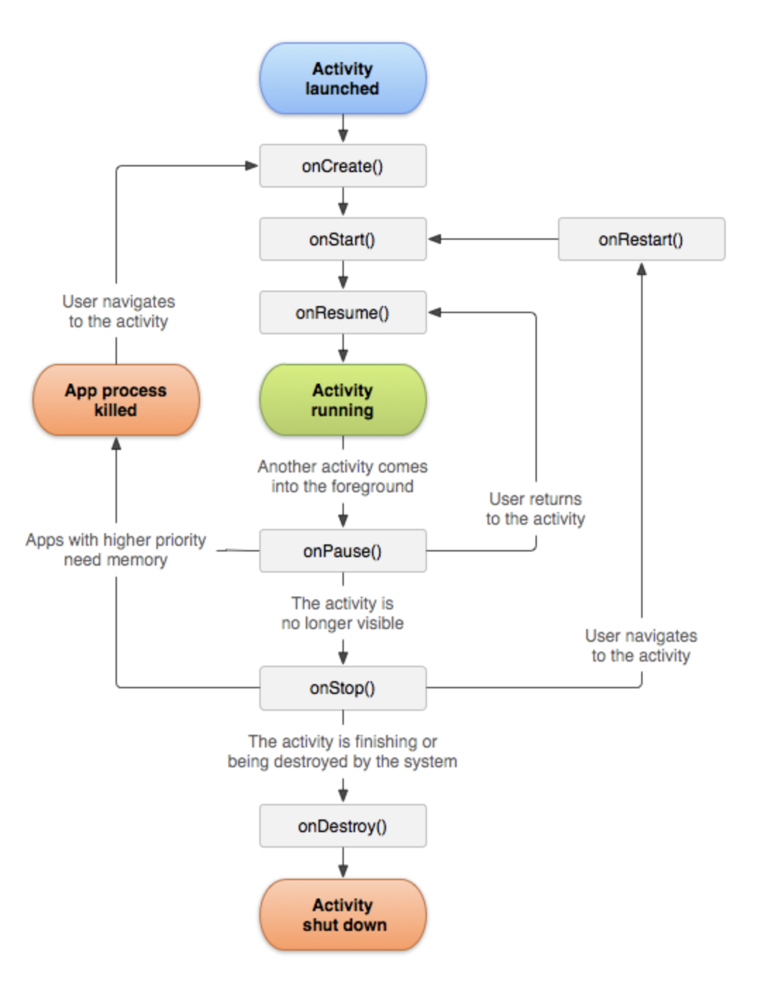

# 안드로이드 기본 개념

## 액티비티
```text
Android의 대표적인 구성 요소 중 하나인 Activity는 UI를 구성하는 기본 단위입니다.
```

### 액티비티의 3가지 상태
```text
재개됨 (Resumed) : 액티비티가 화면 포그라운드에 있고 포커스를 갖습니다.
일시정지됨 (Paused) : 액티비티가 일부가 가려진 상태, 이때는 액티비티가 완전히 살아 있지만(Activity 객체가 메모리에 보관되어 있고, 
    모든 상태 및 멤버 정보를 유지하며 창 관리자에 붙어 있는 상태로 유지), 메로리가 부족한 경우 시스템이 중단시킬 수도 있습니다.
정지됨(Stopped) : 액티비티가 다른 액티비티에 완전히 가려진 상태, 이때는 액티비티가 완전히 살아 있지만(Activity 객체가 메모리에 보관되어 있고,
    모든 상태 및 멤버 정보를 유지하며 창 관리자에 붙어 있는 상태로 유지), 메로리가 부족한 경우 시스템이 중단시킬 수도 있습니다.
```

### 액티비티 생명 주기(Lifecycle)

```text
onCreate() : 액티비티를 생성, 액티비티의 필수 구성 요소를 초기화, setContentView()를 호출해서 액티비티에 UI를 정의할 수 있음
onStart() : 액티비티가 보여지기 시작함
onResume() : 액티비티가 시작되고 사용자와 상호작용하기 직전에 호출
onPause() : 액티비티가 부분적으로 가려짐, 사용자가 액티비티를 떠난다는 신호, 현재 사용자가 세션을 넘어서 정보가 지속되어야 한다면 변경 사항을 커밋하기에 가장 적절한 콜백입니다. (사용자가 돌아오지 않을 수도 있음)
onStop() : 액티비티가 더 이상 사용자에게 표시되지 않으면 호출됩니다.
onRestart() : 액티비티가 중단되었다가 다시 시작되기 전에 호출됩니다.
onDestroy() : 액티비티가 소멸되기 직전에 호출됩니다. 액티비티가 받는 마지막 호출입니다.
```

### 액티비티의 수명
```text
Whole Lifecycle : onCreate() ~ onDestroy(), 액티비티 전체 생명 주기
Visible Lifecycle : onStart() ~ onStop(), 가시적으로 보이는 액티비티 생명 주기
```

## DP(Dip), PX, DPI의 개념

### DPI
```text
DPI는 Dot Per Inch로 1인치에 들어가는 픽셀을 나타내는 단위이다.
에를 들면 100DPI는 1인치당 픽셀이 100개 포함된다는 것을 말한다.
개수가 많을 수록 고밀도이며 안드로이드에서 주요 DPI는 아래와 같다.

ldpi : 120dpi
mdpi : 160dpi (기본)
hdpi : 240dpi
xhdpi : 320dpi
xxhdpi : 480dpi
xxxhdpi : 640dpi
안드로이드의 기준 DPI는 160 DPI이다.
160 DPI인 경우 밀도 독립단위 DP와 PX이 같은 크기를 갖는다.
즉, 16DPI에서는 1dp는 1px이 된다.
```

### DP와 PX의 단위 변환
```text
개발을 하다보면 DP를 PX로 바꿔줘야할 경우가 있다.
안드로이드 레이아웃을 코드 작성 할때 는 DP를 사용할 수가 없기 때문이다.
사용하는 공식은 아래와 같다.

px = dp * 단말 DPI/기본 160
dp = px * 기본 160/단말 DPI
mdpi 지원 단말일 경우 dpi는 160 이므로 1dp 160/160 = 1pixel이 된다.
xxhdpi 지원 단말일 경우, 5dp를 pixel로 계산하면
5dp 480/160 = 15 pixel 이므로 xxhdpi 단말의 5dp는 15pixel이 된다.
```