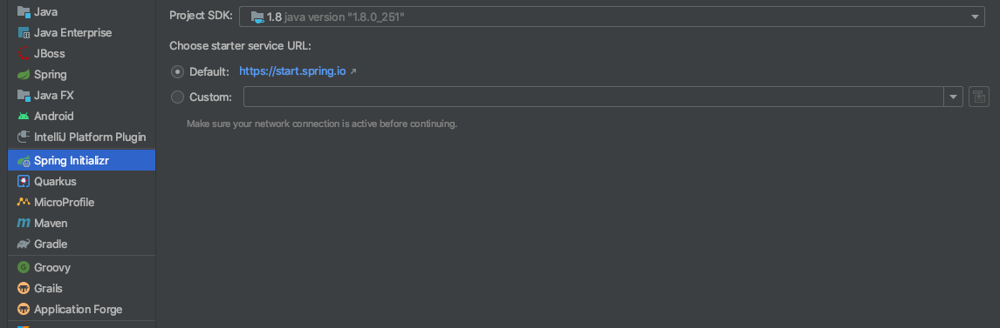
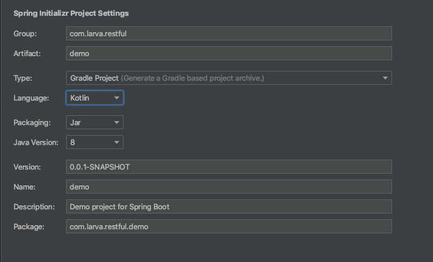
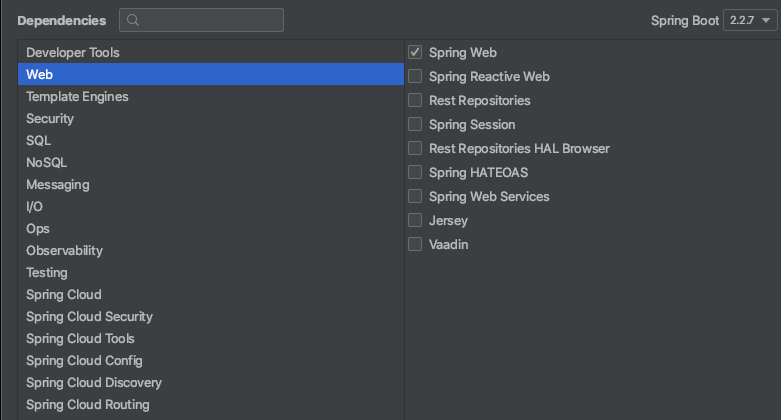
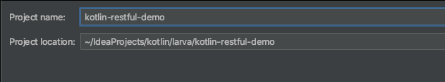
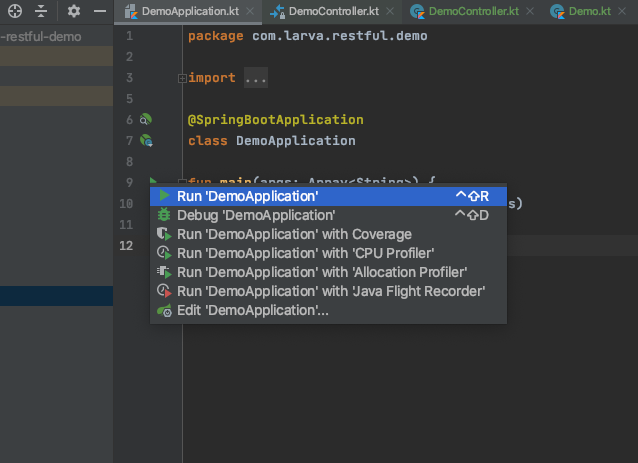
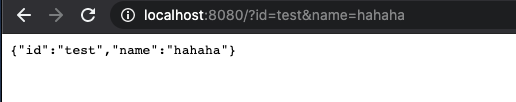
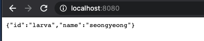

# 코들린 restful 웹서버 만들기 1

intellij 프로젝트 생성 












return data 생성 
```kotlin
package com.larva.restful.demo.data

data class Demo (
        val id: String,
        val name : String
)
```

controller 생성 
```kotlin
package com.larva.restful.demo.controller

import com.larva.restful.demo.data.Demo
import org.springframework.web.bind.annotation.GetMapping
import org.springframework.web.bind.annotation.RequestParam
import org.springframework.web.bind.annotation.RestController

@RestController
class DemoController {

    @GetMapping("/")
    fun demo(@RequestParam(value = "id", defaultValue = "larva") id: String,
             @RequestParam(value = "name", defaultValue = "seongyeong") name: String) =
            Demo(id, name)

}
```

main 시작




Test







github : https://github.com/hwangsungyoung/kotlin-restful-demo