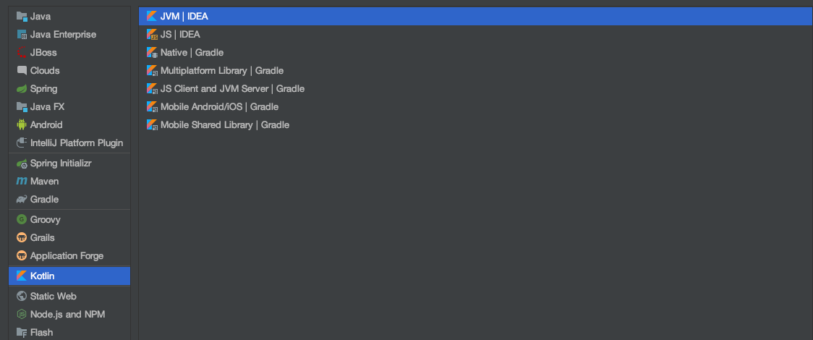
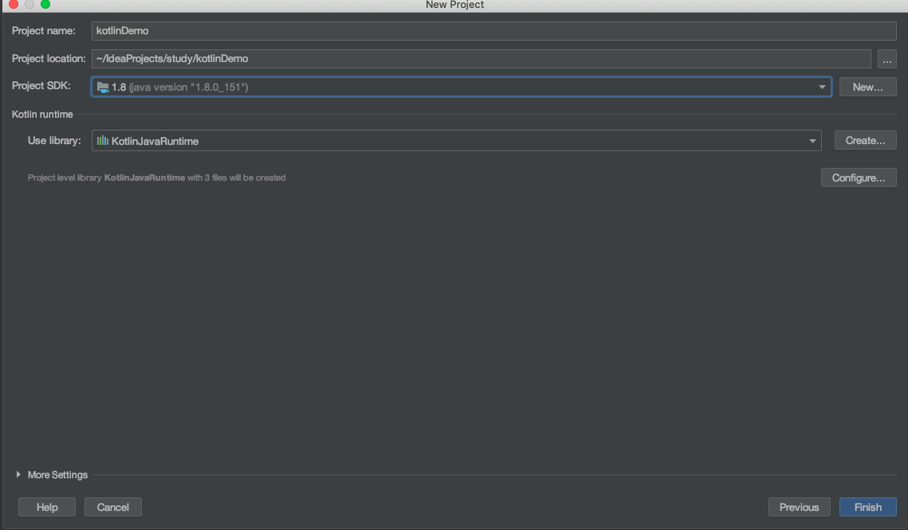
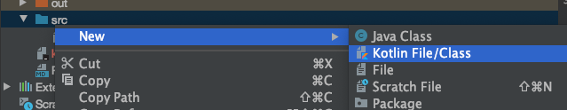
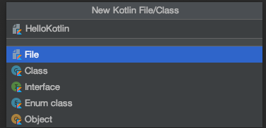

# kotlin 시작하기

2020-04-27 첫 시작 ~~

# intellij 프로젝성트 생성 

코틀린 프로젝트 생성 1



코틀린 프로젝트 생성 2



# hello world

코틀린 파일 생성





```java
fun main() {
    println("Hello Kotlin!")
}
```

# Kotlin 단축기

Messages    Command + 0

Project     Command + 1

Favorites   Command + 2

Run         Command + 4

Debug       Command + 5

TODO        Command + 6

Structure   Command + 7

Terminal    Alt + F12