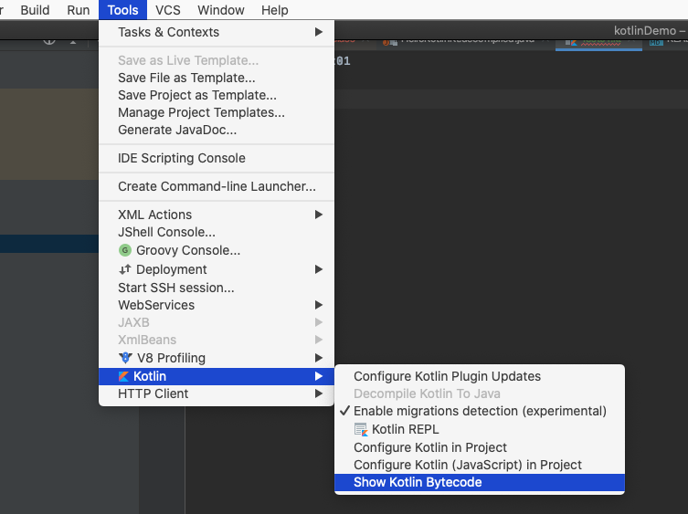

# kotlin 기본문법

코틀린은 java와 다르게 세미콜론을 마지막에 안넣음 

package 생성, 선언 자바와 동

import : java 와 동일 

# Decompile




kotlin 파일을 Decompile 방법은 위의 이미처럼 하면 된다.

java 파일로 생성이 되면 자바 문법으로 변환시켜준다.

# 자료형

```kotlin
fun main(){
    val str: String = "하이!"
    val num: Int = 20
    println("str: $str, num: $num")

    val exp01 = 123     // exp01은 Int로 추론
    val exp02 = 123L    // exp02는 Long으로 추론
    val exp03 = 0x0F    // 16진 표기가 사용된 Int 값
    val exp04 = 0b00001011 // 2진 표기가 사용된 Int 값
    val exp05 = 123.5   // exp05는 Double로 추론
    val exp06 = 123.5e10 // 지수 표현법이 사용된 Double 값
    val exp07 = 123.5f  // exp07은 Float로 추론

    val exp08: Byte = 127 // 명시적으로 자료형을 지정하면 해당 자료형의 값 저장
    val exp09 = 32767 // 값이 Short 범위에 있으나 Int로 추론
    val exp10: Short = 32767 // 명시적으로 자료형 Short를 지정
    val exp11 = 2147483647 // 값이 Int범위에 있으므로 Int로 추론
    val exp12 = 9223372036854775807 // 값의 범위가 Long형 범위에 있으므로 Long으로 추론
    val exp13 = true // exp13은 Boolean으로 추론
    val exp14 = 'c' // exp14는 Char로 추론
    val exp15 = '\u0061' // 유니코드(unicode) 표현법으로 Char 지정
    println("$exp01\n$exp02\n$exp03\n$exp04\n$exp05\n$exp06\n$exp07\n")
    println("$exp08\n$exp09\n$exp10\n$exp11\n$exp12\n$exp13\n$exp14\n$exp15")
}
```

# 변수와 자료형

val : 최초로 지정한 변수의 값으로 초기화 하고 더이상 바꿀 수 없는 일기 전용 변수가 된다.

var : 최초로 지정한 변수의 초깃값이 있더라도 값을 바꿀 수 있다.

```kotlin
fun main() {
    val userName1 = "성영" // 코틀린이 자료형으로 추론하여 userName의 자료형을 String 으로 결정 
    
    val userName2 // 지료형을 지정하지 않은 변수는 사용할 수 없음 
}
```

val var 사용법
```kotlin
fun main() {
    val number = 10  // number는 Int로 추론
    var language = "Korean" // language는 String으로 추론
    val secondNumber: Int = 20 // sercondNumber는 자료형을 Int로 명시적으로 지정
    language = "English" // var 선언이므로 변수의 값을 재할당 할 수 있다.

    println("number: $number")
    println("language: $language")
    println("secondNumber: $secondNumber")
}
```